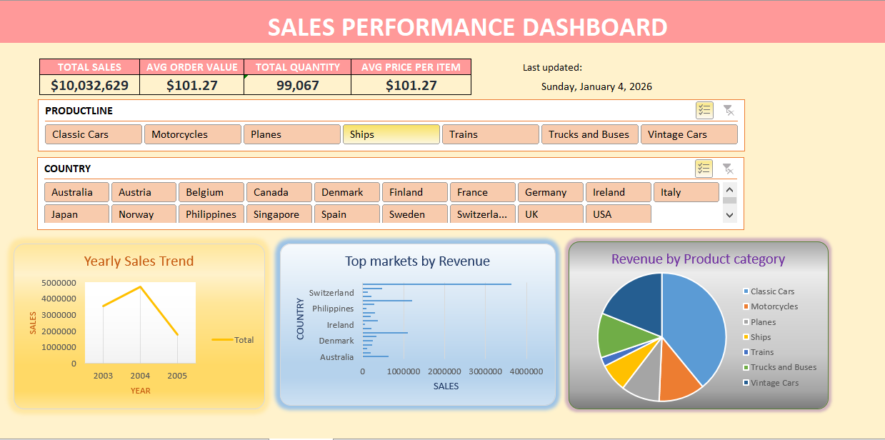
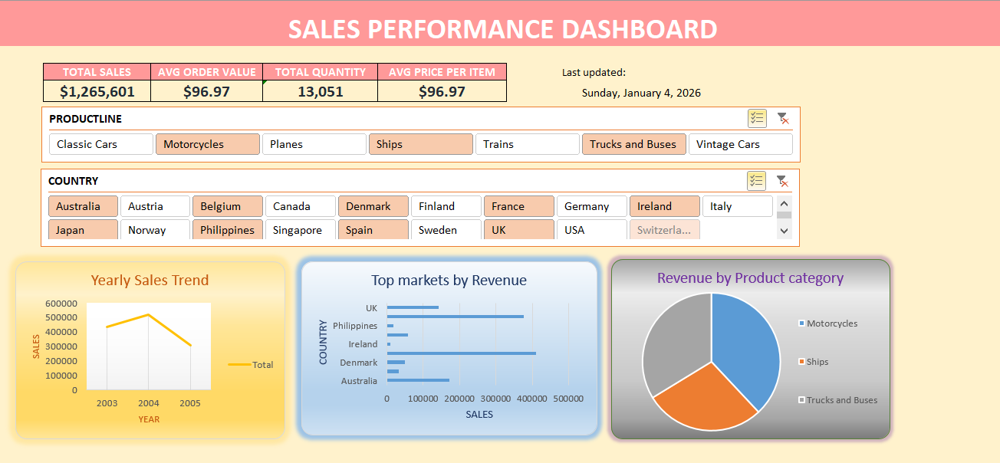
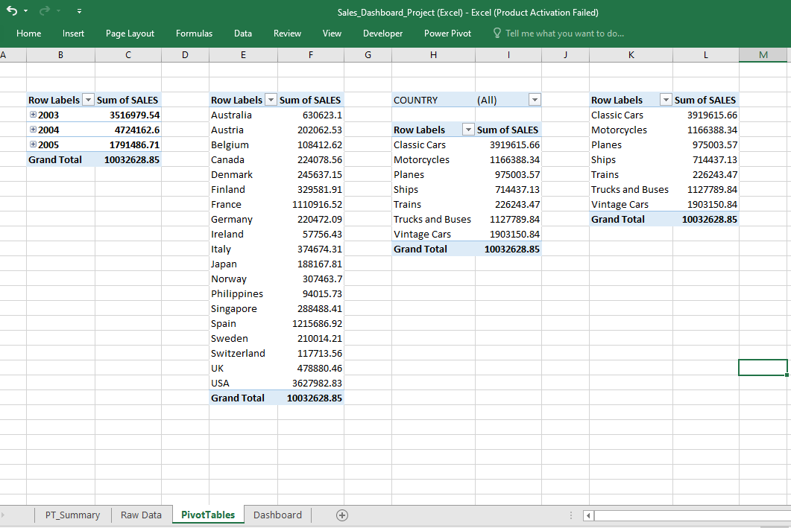
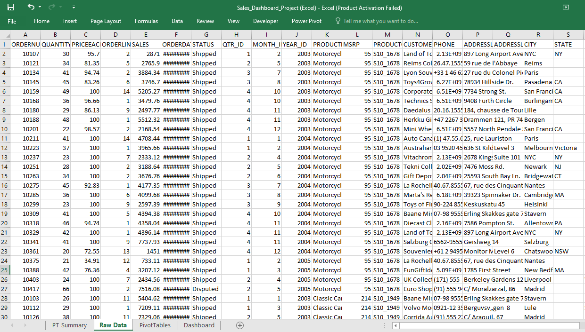

# Sales Performance Dashboard - Excel

## 📊 Project Overview
An interactive Excel dashboard analyzing $10M+ sales data across 20+ countries and 7 product lines, providing real-time insights into sales performance.

## 🎯 Business Objectives
- Track key sales metrics (Revenue, Quantity, AOV)
- Identify top-performing markets and products
- Analyze yearly sales trends (2003-2005)
- Enable data-driven decision making through interactive filters

## 📈 Key Metrics Tracked
| Metric | Value | Insight |
|--------|-------|---------|
| **Total Sales** | $10,032,629 | Overall revenue performance |
| **Average Order Value** | $101.27 | Customer spending behavior |
| **Total Quantity Sold** | 99,067 units | Volume analysis |
| **Average Price per Item** | $101.27 | Pricing strategy effectiveness |

## 🛠️ Excel Features Used

### **Advanced Excel Skills:**
- **PivotTables & PivotCharts** - Dynamic data summarization
- **Slicers & Timeline Filters** - Interactive dashboard controls
- **Advanced Formulas** - SUMIFS, AVERAGEIFS, GETPIVOTDATA
- **Data Validation** - Dropdown lists for filtering
- **Conditional Formatting** - Visual data highlights
- **Named Ranges** - Simplified formula references
- **Chart Customization** - Professional visualizations

### **Dashboard Components:**
1. **KPI Cards** - Top-level metrics with auto-updating values
2. **Yearly Sales Trend** - Line chart showing growth patterns
3. **Top Markets by Revenue** - Horizontal bar chart
4. **Revenue by Product Category** - Donut/Pie chart
5. **Interactive Filters** - Product Line & Country slicers

## 📁 Data Structure
**Dataset Size:** ~2,800+ transactions (2003-2005)

**Key Columns:**
- `ORDERDATE`, `STATUS`, `PRODUCTLINE`, `QUANTITYORDERED`
- `PRICEEACH`, `SALES`, `COUNTRY`, `DEALSIZE`
- `CONTACTFIRSTNAME`, `CONTACTLASTNAME`

**Data Processing:**
- Cleaned and standardized country names
- Calculated derived metrics (AOV, Price per Item)
- Created time-based aggregations (Yearly, Monthly)

## 🚀 How to Use the Dashboard

### **Setup Instructions**
1. Download `sales_dashboard.xlsx`
2. Open in Excel 
3. Navigate to the **Dashboard** sheet
4. Use slicers to filter by:
   - **Product Line** (Classic Cars, Motorcycles, etc.)
   - **Country** (USA, Australia, France, etc.)
5. Observe real-time updates in all charts and metrics

### **Interactive Features:**
- Click any product line to filter entire dashboard
- Select multiple countries using Ctrl+Click
- Hover over charts to see detailed values
- Use the **Refresh Data** button if source data updates

## 📊 Insights Discovered

### **Key Findings:**
1. **Top Product Line**: Classic Cars generated highest revenue
2. **Growth Trend**: Sales peaked in 2004, declined slightly in 2005
3. **Best Market**: USA dominated sales, followed by Australia
4. **Average Deal Size**: Most transactions were "Medium" sized deals

### **Business Recommendations:**
- Focus marketing on Classic Cars in US market
- Investigate 2005 sales decline for corrective action
- Expand "Small" deal conversion to "Medium" deals

## 📸 Dashboard Screenshots

### **Main Dashboard View**

### **Interactive Filtering**

### **PivotTable Structure**

### **Raw Data Sample**

### **PivotTable Configuration:**
Rows: Year, Country, ProductLine

Values: Sum of SALES, Sum of QUANTITYORDERED

Filters: STATUS, DEALSIZE

Slicers: PRODUCTLINE, COUNTRY

### **📈 Skills Demonstrated:**
This project showcases proficiency in:

Data Analysis: Transforming raw data into actionable insights

Dashboard Design: Creating user-friendly, interactive interfaces

Business Intelligence: Connecting data to business decisions

Excel Mastery: Advanced features beyond basic spreadsheet use

## 📩 Feedback & Collaboration

Feel free to:  
- ⭐ Star this repo if you find it helpful  
- 🛠 Suggest improvements via [Issues](https://github.com/DaniaFarooq)  
- 📥 Contribute through Pull Requests

## Author
> Excel Dashboard created by **Dania Farooq**  
